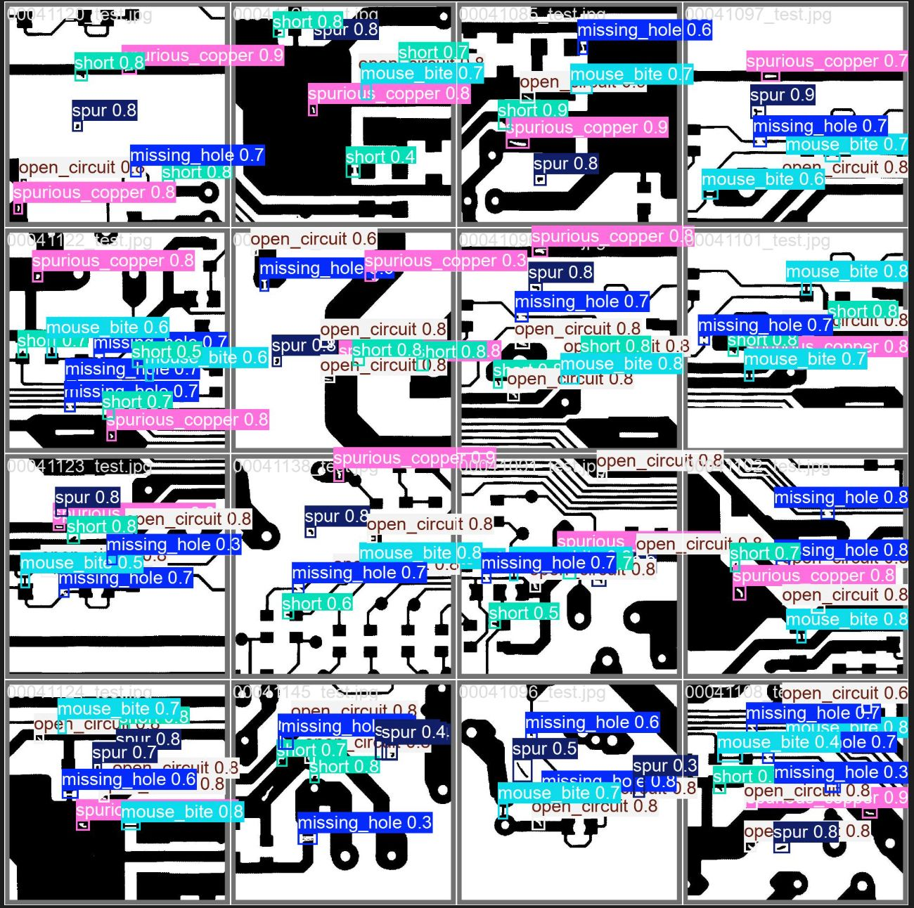
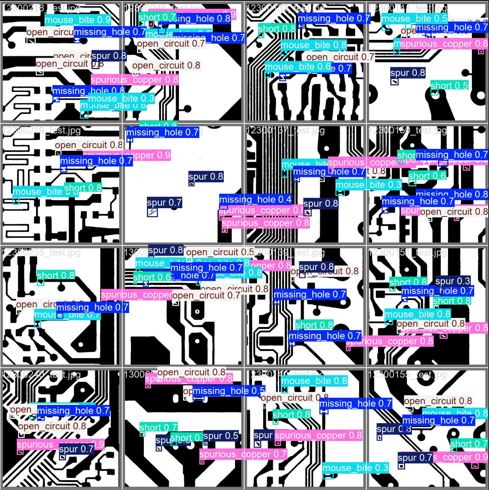
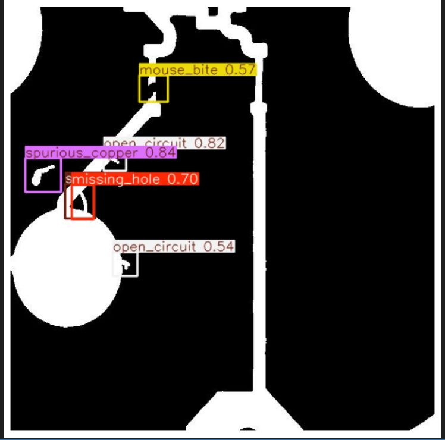
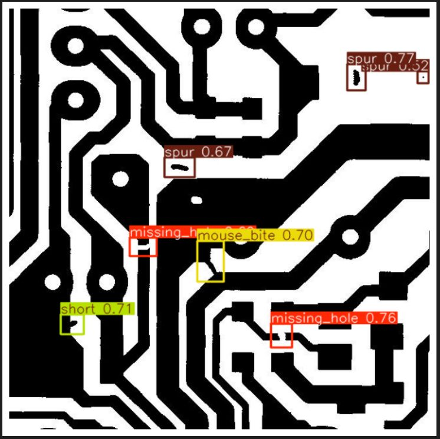
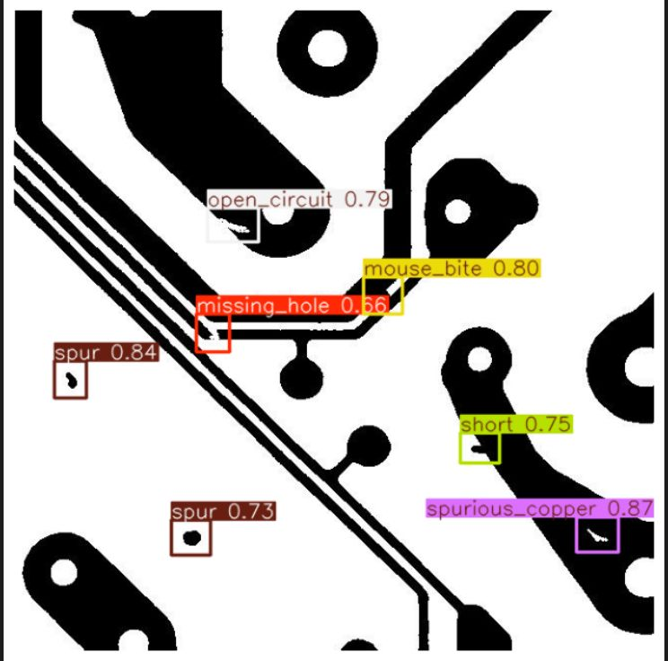
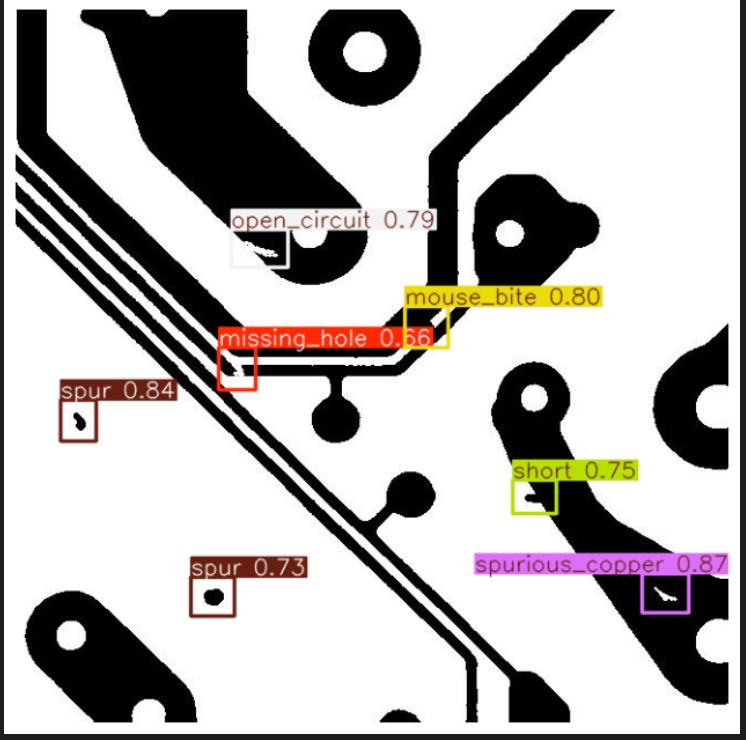

# Automated Quality Inspection System for PCB Manufacturing

A deep learning system for automated detection and classification of defects in Printed Circuit Boards (PCBs) using YOLOv8.



## Overview

This project implements an automated PCB defect detection system for manufacturing quality control. The system identifies, localizes, and classifies six types of PCB defects, providing detailed inspection reports with defect coordinates and severity levels.

**Key Capabilities:**
- Real-time detection with fast inference
- Multi-class classification for 6 defect types
- Precise localization with exact coordinates
- Severity assessment (CRITICAL, HIGH, MODERATE)
- Detailed inspection reports with confidence scores

## Features

**Automated Defect Detection**
- Detects multiple defects in a single PCB image
- Provides bounding boxes around detected defects
- Real-time visualization of detection results

**Defect Localization**
- Precise center coordinates (x, y) for each defect
- Bounding box coordinates for exact location
- Visual overlay on original images

**Defect Classification**
- 6 distinct defect categories
- Confidence scores for each detection
- Class-specific handling and reporting

**Severity Analysis**
- CRITICAL: Missing holes, shorts, open circuits
- HIGH: Defects with >70% confidence
- MODERATE: Other detected defects

**Inspection Reports**
```
--- INSPECTION REPORT ---
DEFECT              | CONF      | CENTER (x,y)    | SEVERITY
----------------------------------------------------------------
missing_hole        | 0.85      | (245, 187)      | CRITICAL
mouse_bite          | 0.72      | (389, 412)      | HIGH
spurious_copper     | 0.68      | (156, 298)      | MODERATE
```

## Defect Types

The system detects the following PCB defects:

| Defect Type | Description | Severity Level |
|------------|-------------|----------------|
| Missing Hole | Absence of required drilling holes | CRITICAL |
| Mouse Bite | Small notch at the edge of a trace | HIGH/MODERATE |
| Open Circuit | Break in the conducting path | CRITICAL |
| Short | Unintended connection between conductors | CRITICAL |
| Spur | Unwanted copper protrusion | HIGH/MODERATE |
| Spurious Copper | Excess copper on the PCB surface | HIGH/MODERATE |

## Technology Stack

- Deep Learning Framework: Ultralytics YOLOv8
- Programming Language: Python 3.8+
- Computer Vision: OpenCV
- Data Visualization: Matplotlib
- Configuration: YAML
- Numerical Computing: NumPy <2.0
- Model Architecture: YOLOv8n (Nano variant)

## Installation

**Prerequisites**
- Python 3.8 or higher
- CUDA-compatible GPU (recommended for training)
- 8GB+ RAM

**Setup**

1. Clone the repository
```bash
git clone https://github.com/vanshikaxcx/Automated-Quality-Inspection-System-for-Manufacturing.git
cd Automated-Quality-Inspection-System-for-Manufacturing
```

2. Install dependencies
```bash
pip install "numpy<2.0"
pip install ultralytics
pip install opencv-python
pip install matplotlib
pip install pyyaml
```

3. Verify installation
```python
import ultralytics
ultralytics.checks()
```

## Usage

**Training the Model**

```python
from ultralytics import YOLO
import yaml

# Configure dataset
data_config = {
    'path': '/path/to/dataset',
    'train': 'images/train',
    'val': 'images/val',
    'names': {
        0: 'missing_hole',
        1: 'mouse_bite',
        2: 'open_circuit',
        3: 'short',
        4: 'spur',
        5: 'spurious_copper'
    }
}

# Save configuration
with open('data.yaml', 'w') as f:
    yaml.dump(data_config, f)

# Initialize and train model
model = YOLO('yolov8n.yaml')
results = model.train(
    data='data.yaml',
    epochs=100,
    imgsz=640,
    batch=16,
    optimizer='AdamW',
    lr0=0.01
)
```

**Running Inference**

```python
from ultralytics import YOLO
import cv2
import matplotlib.pyplot as plt

# Load trained model
model = YOLO('best.pt')

# Run prediction
results = model.predict('test_image.jpg', conf=0.25)

# Visualize results
result = results[0]
plt.figure(figsize=(12, 8))
plt.imshow(result.plot())
plt.axis('off')
plt.show()
```

**Detailed Defect Analysis**

```python
def analyze_pcb_defect(image_path, model_path='best.pt'):
    model = YOLO(model_path)
    results = model.predict(image_path, conf=0.20, save=False)
    result = results[0]
    
    detected_defects = []
    
    for box in result.boxes:
        x1, y1, x2, y2 = box.xyxy[0].tolist()
        center_x = int((x1 + x2) / 2)
        center_y = int((y1 + y2) / 2)
        
        cls_id = int(box.cls)
        class_name = result.names[cls_id]
        conf = float(box.conf)
        
        # Determine severity
        if class_name in ['missing_hole', 'short', 'open_circuit']:
            severity = "CRITICAL"
        elif conf > 0.7:
            severity = "HIGH"
        else:
            severity = "MODERATE"
        
        detected_defects.append({
            "type": class_name,
            "center": (center_x, center_y),
            "severity": severity,
            "confidence": conf
        })
        
        print(f"Defect: {class_name:<15} | Center: ({center_x:>4}, {center_y:>4}) | "
              f"Severity: {severity:<8} | Conf: {conf:.2f}")
    
    return result.plot(), detected_defects

# Analyze PCB image
annotated_image, defects = analyze_pcb_defect('pcb_sample.jpg')
```

## Model Architecture

**YOLOv8n Configuration**
- Base Model: YOLOv8 Nano (lightweight variant)
- Training Strategy: From scratch
- Input Size: 640x640 pixels
- Optimizer: AdamW
- Learning Rate: 0.01
- Batch Size: 16
- Epochs: 100

**Training Parameters**
```yaml
Model: YOLOv8n
Optimizer: AdamW
Learning Rate: 0.01
Batch Size: 16
Image Size: 640x640
Epochs: 100
Confidence Threshold: 0.20 (training), 0.25 (inference)
```

## Results

**Model Performance**

The model demonstrates strong performance across all defect categories:




**Overall Metrics**
- mAP@0.5: 0.961 (96.1%)
- F1-Score: 0.91 at confidence 0.391
- Optimal Precision: 1.00 at confidence 0.929

**Per-Class Performance**

| Defect Type | Recall | mAP@0.5 |
|------------|--------|---------|
| Missing Hole | 97.1% | 0.971 |
| Mouse Bite | 91.4% | 0.914 |
| Open Circuit | 96.9% | 0.969 |
| Short | 97.2% | 0.972 |
| Spur | 97.7% | 0.977 |
| Spurious Copper | 96.0% | 0.960 |

**Confusion Matrix Analysis**

Classification accuracy from normalized confusion matrix:

- Missing Hole: 93%
- Mouse Bite: 86%
- Open Circuit: 90%
- Short: 92%
- Spur: 93%
- Spurious Copper: 94%

Low false positive rates across all classes with background detection well-controlled (5-13% false positives).

**Sample Detection Output**









```
Image: pcb_sample.jpg
------------------------------------------------------------
DEFECT              | CONF      | CENTER (x,y)    | SEVERITY
------------------------------------------------------------
missing_hole        | 0.89      | (234, 156)      | CRITICAL
open_circuit        | 0.76      | (445, 289)      | CRITICAL
mouse_bite          | 0.71      | (178, 334)      | HIGH
spur                | 0.65      | (512, 423)      | MODERATE
spurious_copper     | 0.58      | (89, 201)       | MODERATE
```

**Performance Curves**

1. F1-Confidence Curve: Optimal F1-score of 0.91 at confidence threshold 0.391
2. Precision-Recall Curve: mAP@0.5 of 0.961 with individual class performance from 0.914 to 0.977
3. Precision-Confidence Curve: Perfect precision (1.00) at confidence 0.929
4. Recall-Confidence Curve: Recall of 0.98 at optimal confidence
5. Confusion Matrix: Strong diagonal patterns confirming accurate classification

## Dataset

**DeePCB Dataset**

The model is trained on the DeePCB dataset, a collection of PCB images with annotated defects.

Dataset Structure:
```
deep-pcb/
├── images/
│   ├── train/          # Training images
│   └── val/            # Validation images
└── labels/
    ├── train/          # Training annotations
    └── val/            # Validation annotations
```

Dataset Statistics:
- Multiple high-resolution PCB images
- Annotated defects in YOLO format
- Balanced distribution across defect classes
- Train/validation split for evaluation

## Project Structure

```
Automated-Quality-Inspection-System-for-Manufacturing/
├── pcb-detection.ipynb      # Main Jupyter notebook
├── README.md                 # Project documentation
├── 1.jpeg                    # Inference result 1
├── 2.jpeg                    # Inference result 2
├── 3.jpeg                    # Inference result 3
├── 4.jpeg                    # Inference result 4
├── inf1.jpeg                 # Inference cluster result 5
└── inf2.jpeg                 # Inference cluster result 6
```

## Workflow

1. **Data Preparation**
   - Load and organize PCB images
   - Create YAML configuration file
   - Set up train/validation splits

2. **Model Training**
   - Initialize YOLOv8n architecture
   - Train from scratch on PCB dataset
   - Monitor training metrics
   - Save best model weights

3. **Model Evaluation**
   - Generate performance metrics
   - Analyze confusion matrices
   - Review precision-recall curves
   - Validate on test images

4. **Inference & Deployment**
   - Load trained model
   - Process new PCB images
   - Generate inspection reports
   - Visualize detection results

